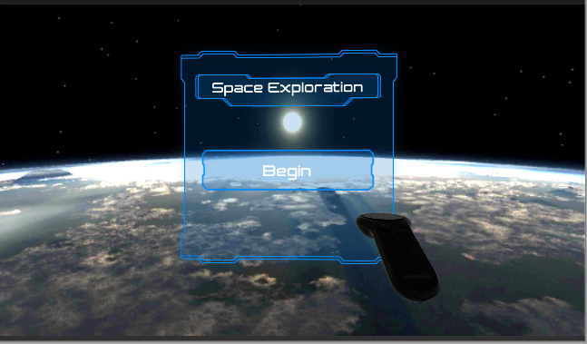

# VR_Space_Xplorer

VR based space simulation app with voice control  to replace traditional learning methods

with a more interactive and immersive approach.

### **Details**

* The project is made built in Unity Engine and the the models are bulit in Unity as well as belender.
* The project size is very big so I have uploaded the RAR file in drive.
* To run the project frst download the file from [this](https://drive.google.com/file/d/17vwVHaql56WEw6-Z26zz7UBGswMzbqBh/view?usp=sharing) link.
* Unzip the .rar file and then upload this in Unity.

##### Overview of the project

